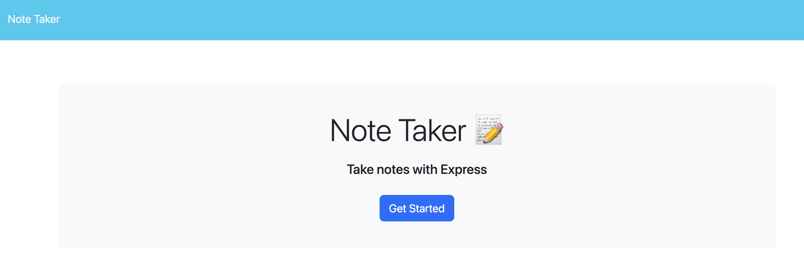
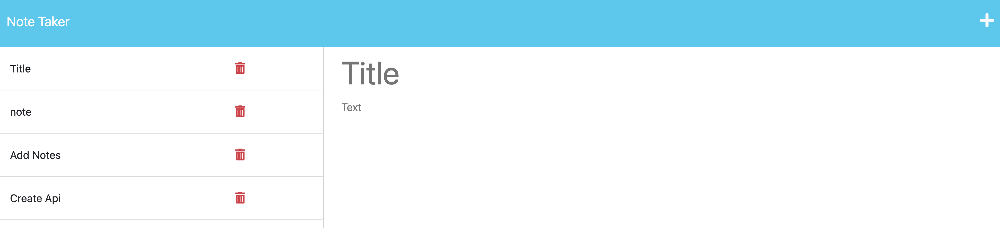

# Note Taker 

## Description 
  As a small business owner, I want to be able to write and save notes to organize my thoughts and to keep track of tasks needed to be completed.

## Table of Contents
[Installation](#installation) 

[Usage](#usage)

[License](#license)

[Credits](#credits)

[Tests](#tests)

[Questions](#questions)

## Installation 
  clone the repository and on the command line install libraries, and then type node server.js to run the server.

## Usage 
  Write a note and click the save button to save note.  Click on the note to view its contents.  Keep track of daily duties, or tasks to be completed.

Visit the site at:
https://organize-note-05cd8fd11513.herokuapp.com/

Visit the repository at:
https://github.com/marbfree/Note-Taker

## Credits 
  Thank you, Benicio Lopez, for helping me understand Heroku and for deploying the app.

## License
  None
      
      
## Tests 
  
## Questions
Check out my GitHub at https://github.com/marbfree 

Contact me at mariannabfree@gmail.com for any further questions.
